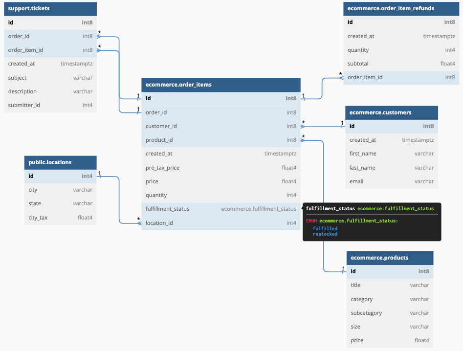

# learning-ecommerce

## Context

Let's build out pseudo-E-commerce datasets to ease the learning in Data & Analytics projects through practice.

## Database Schema

 

The database diagram consists of four main tables. The `order_items` table granularity is per order item, where one order may contain more than one (distinct) item. Each order set by a customer has at least one product/item, comes from a specific location, and may contain a related support ticket or refund (in progress).